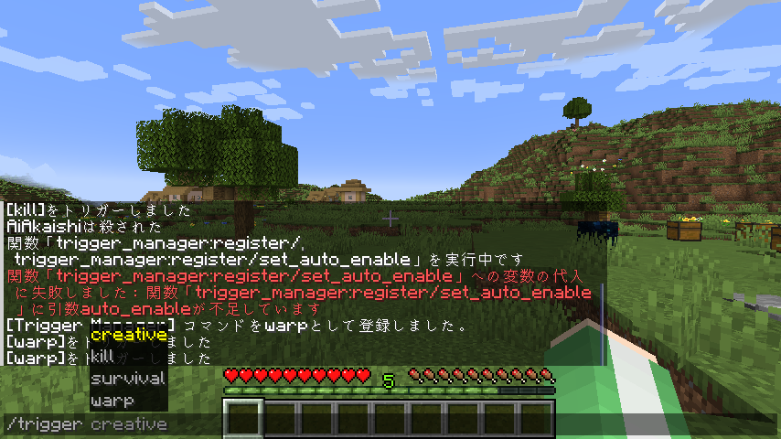

# TriggerManager

[日本語で読む](README_ja.md)

This datapack allows you to allow non-privileged players to execute specific commands.  


## Tested Versions

- 1.21.4

## How to Use

Place this datapack in the `datapacks` folder of your world.

### How to Add Commands

`function #trigger:register {name:<trigger name>, command:<command>}`  
`function #trigger:register {name:<trigger name>, command:<command>, auto_enable:<auto-enable state>}`  
`auto_enable` is optional. If omitted, it defaults to `true` (enabled by default).

- **`<trigger name>`**: The name of the trigger used to execute the command. You can use alphanumeric characters and symbols (`._-`).  
  Example: `name:"creative"`
- **`<command>`**: The command to be executed.  
  Example: `command:'gamemode creative'`  
- **`<auto-enable state>`**: If set to `false`, only enabled players can use the trigger.  
  Example: `auto_enable:false`

```mcfunction
function #trigger:register {name:"creative", command:'gamemode creative', auto_enable:false}
```

### How to Use Added Commands

0. For triggers with `auto_enable:false`, you must enable players who are allowed to use the command:  
   `scoreboard players enable <player> <trigger name>`  
1. Use the `trigger` command to execute the registered command:  
   `trigger <trigger name>`

```mcfunction
scoreboard players enable @a creative
trigger creative
```

### How to Disable a Trigger for Specific Players

For triggers with `auto_enable:false`, you can disable access for players who were previously enabled:  
`scoreboard players reset <player> <trigger name>`

```mcfunction
scoreboard players reset @a creative
```

### How to Remove a Command

`function #trigger:unregister {name:<trigger name>}`

- **`<trigger name>`**: The name of the trigger to be removed.

```mcfunction
function #trigger:unregister {name:"creative"}
```

## Contact

<https://twitter.com/AiAkaishi>

## License

These codes are released under the MIT License. See the LICENSE file for details.
