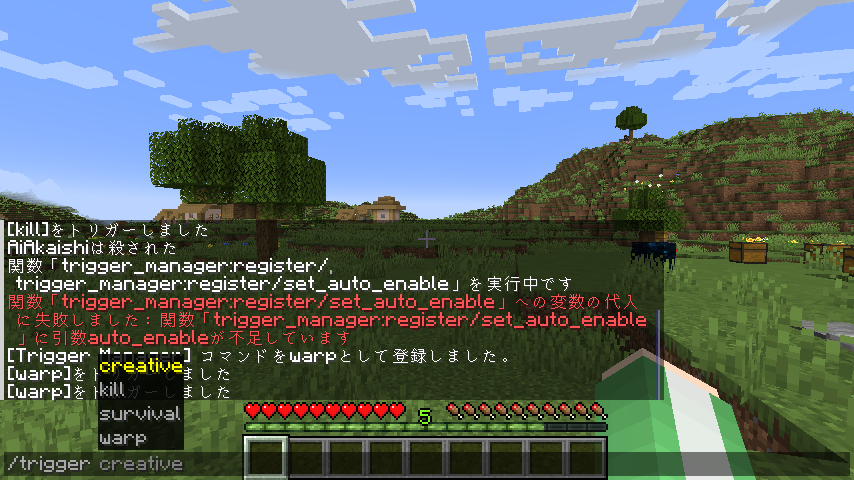

# TriggerManager

[Read in English](README.md)

権限のないプレイヤーにも好きなコマンドを許可できるデータパックです。  


## 動作確認済みバージョン

- 1.21.4

## 使い方

ワールドの`datapacks`フォルダに入れてください。  

### コマンドの追加の仕方

`function #trigger:register {name:<トリガーの名前>, command:<コマンド>}`  
`function #trigger:register {name:<トリガーの名前>, command:<コマンド>, auto_enable: <最初から有効化されるかどうか>}`  
auto_enableは省略可能。省略した場合はtrue(最初から有効)と同じです。  

- **`<トリガーの名前>`**：コマンドを実行するときのトリガー名です。半角英数字と記号 (`._-`)が使えます。  
  例：`name:"creative"`
- **`<コマンド>`**：実行されるコマンドです。  
  例：`command:'gamemode creative'`  
- **`<最初から有効化されるかどうか>`**：falseにしておくと、有効化されたユーザーじゃないと使えなくなります。  
  例：`auto_enable:false`

```mcfunction
function #trigger:register {name:"creative", command:'gamemode creative', auto_enable: false}
```

### 追加されたコマンドの使い方

0. 最初から有効化されない設定の場合、コマンドを使わせたいプレイヤーを有効化する必要があります。  
  `scoreboard players enable <有効化したいプレイヤー> <有効化したいトリガー名>`
1. triggerコマンドで登録されたコマンドを実行できます。  
  `trigger <トリガー名>`  

```mcfunction
scoreboard players enable @a creative
trigger creative
```

### 一部のプレイヤーだけ無効化する方法

最初から有効化されない設定の場合、既に有効化されたプレイヤーでも、無効化することができます。  
`scoreboard players reset <無効化したいプレイヤー> <無効化したいトリガー名>`

```mcfunction
scoreboard players reset @a creative
```

### 追加したコマンドの削除の仕方

`function #trigger:unregister {name:<トリガーの名前>}`  

- **`<トリガーの名前>`**：削除したいコマンドのトリガー名です。  

```mcfunction
function #trigger:unregister {name:"creative"}
```

## 連絡はこちら

<https://twitter.com/AiAkaishi>

## ライセンス

これらのコードはMITライセンスの下で公開されています。LICENSEファイルを参照してください。
